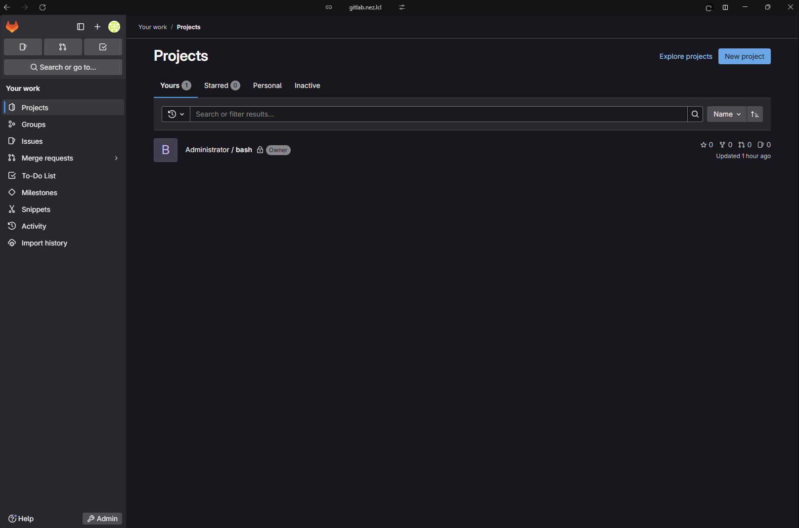
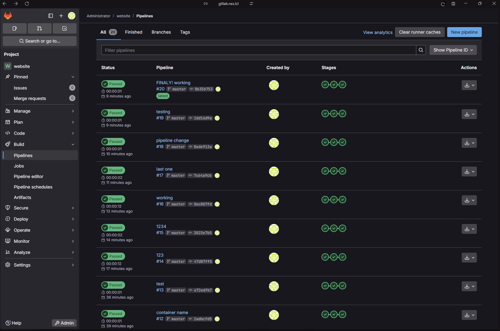
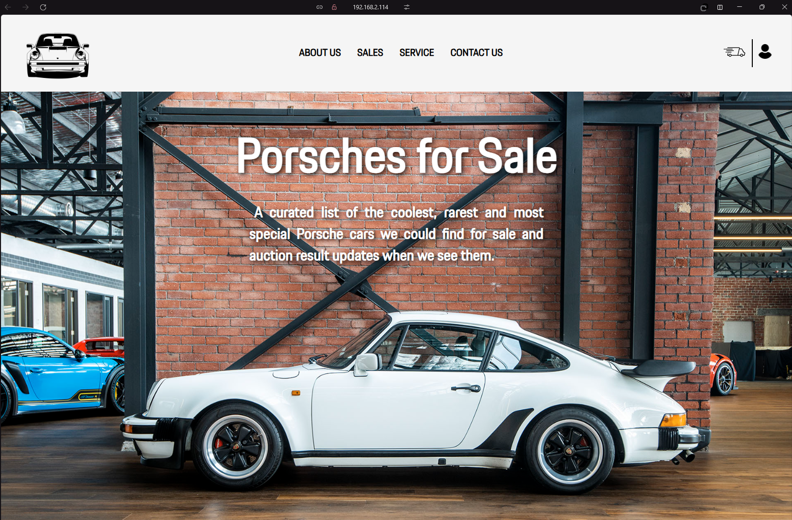

# testcase
Тестовое задание №1

Команда для запуска плейбука:

ansible-playbook -i ./hosts ./docker_install.yml --ask-pass --limit remote

Контейнер с gitlab запущен на виртуалке homelab1:

Веб интерфейс доступен по https://gitlab.nez.lcl (только в локальной сети):

Тестовое задание №2
В качестве веб сервера был выбран nginx, развернутый в контейнере через docker-compose на виртуальной машине 192.168.2.114. 
На той же виртуальной машине установлен gitlab runner.
В качестве сайта была использована контрольная работа с предмета Основы Web-программирования
репозиторий с gitlab был подключен к VS code с терминалом git-bash

